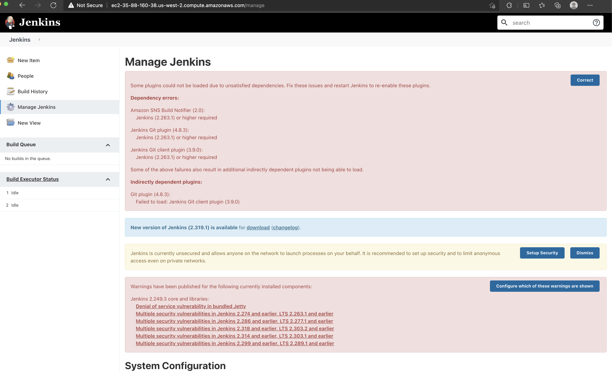

The following tasks are examples of what lab operations specialists may encounter in the field. Complete the tasks and submit your assignment when ready.

Some tasks require an AWS account to create a CloudFormation stack. The resources created are free-tier eligible.

## Task 1 & 2 - Infrastructure Code and Security Policy Updates

The `cloudformationA.yaml` file includes a CloudFormation template that deploys a lab environment. The environment includes a Lambda Function, a DynamoDB table, and other resources including the student user. The student user is the user that should be used by lab end-users to perform the lab. The student user has an IAM policy attached to them to limit their access in AWS to what is needed for the lab.

However, 

1. The CloudFormation stack fails to deploy. Resolve the error so the stack creates successfully.
2. The student user needs access to view the items in the DynamoDB table that they will later create using the lambda function.  Update the policy to allow the student user to achieve that.

### Deliverables

1. Submit the updated CloudFormation template.
2. Submit a brief write-up explaining the steps you took to resolve the issues.

## Task 3 - Linux/Bash Update

The `cloudformationB.yaml` file includes a CloudFormation template based on a lab that deploys a Jenkins server with a Git and SNS notification plugin on a Ubuntu-based EC2 instance (Username for connecting via SSH is: _ubuntu_). Jenkins and the plugins are installed using commands in the EC2 instance's user data. This template must be deployed in the **us-west-2** AWS region. To deploy the stack, you must set the KeyName parameter to an [EC2 key pair name in your account in the us-west-2 region](https://us-west-2.console.aws.amazon.com/ec2/v2/home?region=us-west-2#KeyPairs:). Once the CloudFormation stack deploys and a few additional minutes have elapsed to allow the user data to complete, you can access the Jenkins management web interface using the JenkinsManagementUrl template output.

However, the Jenkins Server reports errors about the SNS and Git plugins:

This prevents students from using the plugins required by the lab. You must find a way to make the plugins operational by editing the user data.

### Deliverables

1. Submit the updated CloudFormation template.

There are no other deliverables. However, 

- Be prepared to discuss alternate solutions if you considered any other approaches. For example, if you had more time would you use a different approach and what tradeoffs are involved?
- Take note of anything you notice in the CloudFormation template that could be improved while working on the task.

Remember to delete the stack once finished to stop the costs for the instance.

## Task 4 - Python Comprehension

Cloud Academy labs validate the work performed by students using functions calling cloud vendor APIs. The validation functions are written in Python.

Prepare to discuss the code in `validate.py`. Your understanding can be based exclusively on reading the names/keywords in the code and general comprehension of Python. If desired you may also consult the [Azure SDK for Python reference](https://docs.microsoft.com/en-us/python/api/?view=azure-python).

## Deliverable

No deliverable required. Just be prepared to discuss the function.
